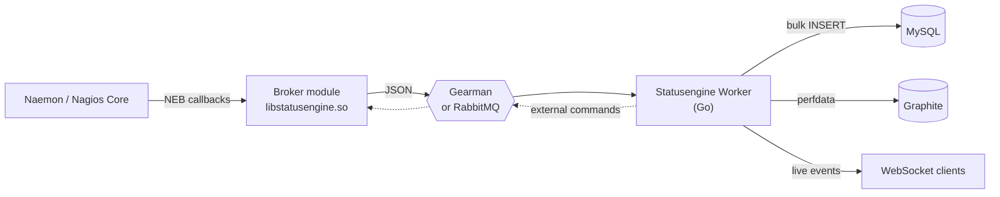

  Naemon &amp; Nagios, event by event

  <!-- The glow is an absolutely positioned duplicate inside the emphasis
       element, so the emphasised part has to be one word that never wraps: at
       the mobile clamp floor that is roughly twelve characters. See
       .se-hero__glow in assets/css/custom.css. -->
  <h1 class="se-hero__title">Every monitoring event, stored and <em>streamedstreamed</em></h1>

  

    Statusengine takes every event out of your monitoring core the moment it
    happens and hands it to a message queue. A Go worker drains that queue:
    history and current state into MySQL, performance data into Graphite, and a
    live WebSocket stream for anything that wants the events as they arrive.
  

  

    <a class="se-btn se-btn--primary" href="docs/">Read the documentation</a>
    <a class="se-btn se-btn--ghost" href="https://github.com/statusengine" target="_blank" rel="noreferrer">Source on GitHub</a>
  

The three moving parts


  
  
  


How data flows

The dotted path back to the core is what makes the queue two-way: the worker can
accept external commands over HTTP and publish them onto the command queue, and
the broker consumes them and hands them to the monitoring core.

Why a queue at all


  
  
  


Start here


  
  
  

